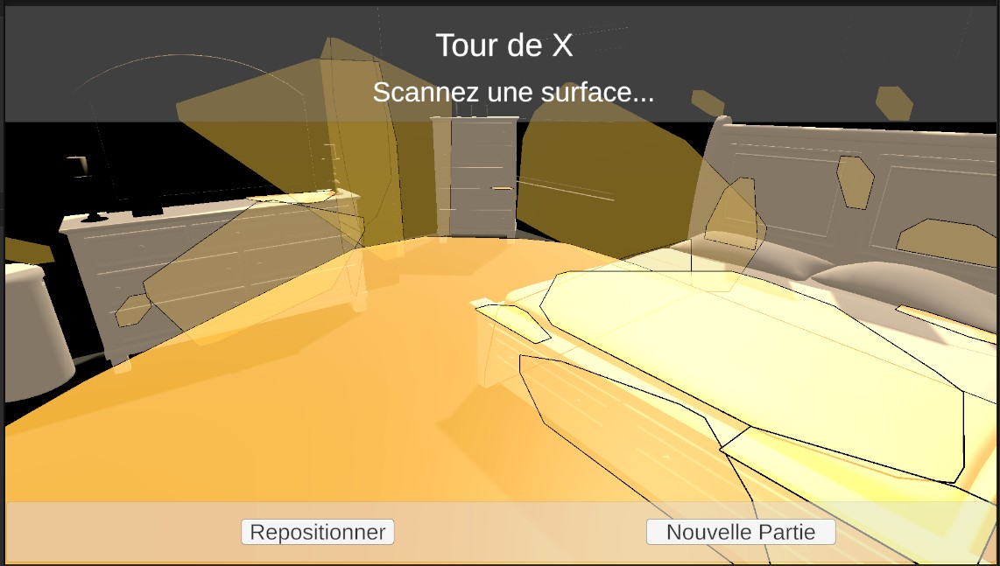
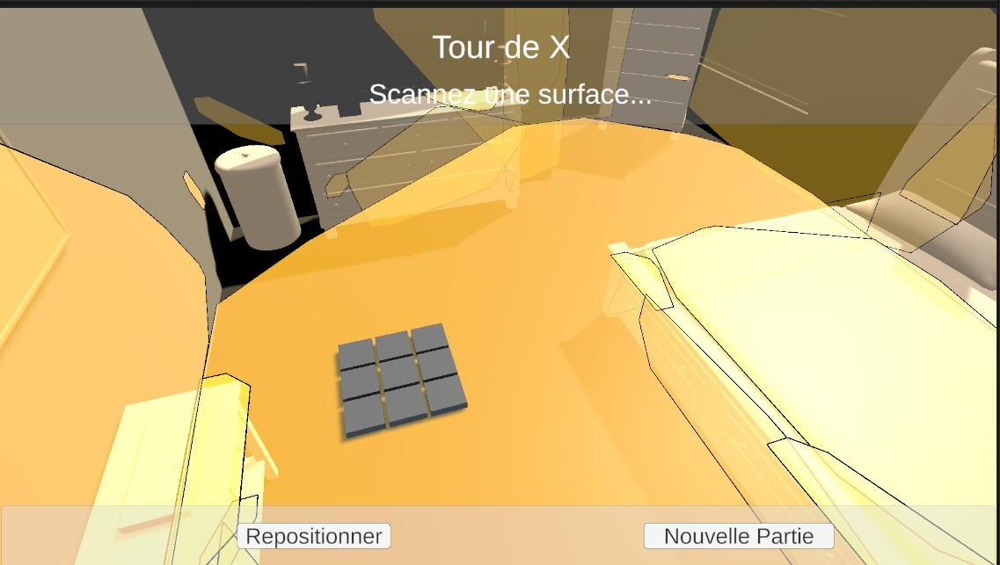
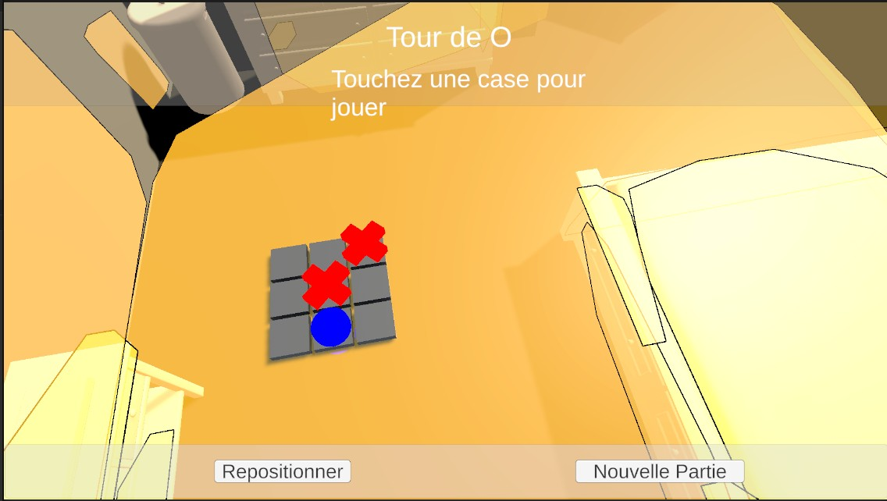
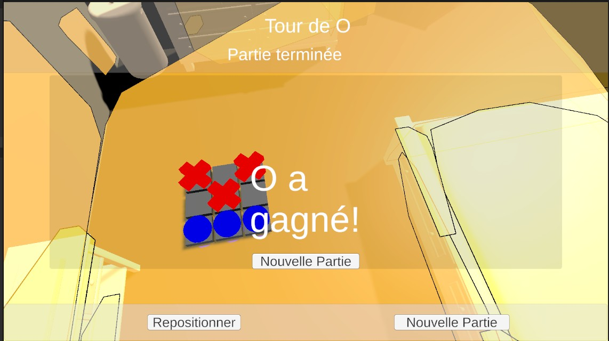
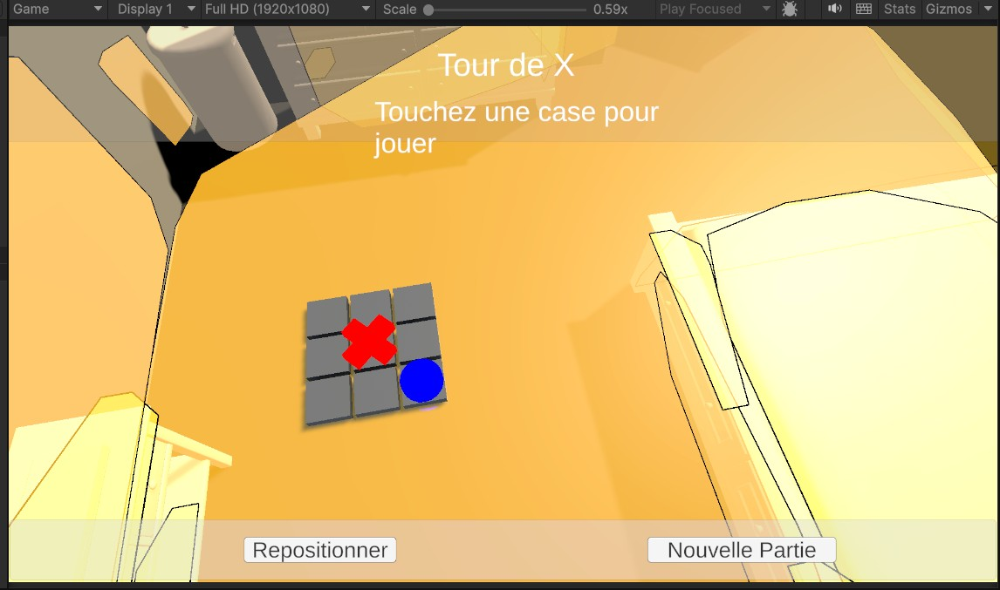

# TicTacToe-AchrafErrihani

Exercice sommatif - Tic Tac Toe en Réalité Augmentée
Tic Tac Toe en Réalité Augmentée

Auteur:
Achraf Errihani.
Techniques de l’informatique.
Cégep de Victoriaville.
Hiver 2026.

# Captures d’écran

## Détection de plan



Description :
Visualisation des plans horizontaux détectés par AR Plane Manager.

## 2Placement de la grille



Description :
La grille est placée sur un plan horizontal via AR Raycast après un tap.

## Partie en cours



Description :
Alternance des joueurs X et O avec mise à jour du texte “Tour de X / Tour de O”.

## Fin de partie – Victoire



Description :
Affichage du message de victoire et activation du GameOverPanel.

## Interface complète



Description :
StatusPanel en haut, boutons en bas, grille en AR au centre.

# Défis rencontrés et solutions

## Conflit Input System

### Problème :

Erreur :

```
InvalidOperationException: You are trying to read Input using UnityEngine.Input
```

### Cause :

Unity configuré sur “Input System Package” uniquement.

### Solution :

Project Settings -> Player -> Active Input Handling -> **Both**
Redémarrage de Unity.

---

## Problème ARAnchorManager détruit

### Problème :

```
MissingReferenceException: ARAnchorManager has been destroyed
```

### Cause :

Tentative de suppression d’ancre après destruction de l’objet.

### Solution :

Ajout de vérification null avant suppression et meilleure gestion de ResetPlacement().

## Warning FindObjectOfType obsolète

### Problème :

Unity 6 affiche :

```
FindObjectOfType is obsolete
```

### Solution :

Remplacement par :

```csharp
FindFirstObjectByType<T>()
FindObjectsByType<T>(FindObjectsSortMode.None)
```

# Annexe – Requêtes utilisées pour écrire du code

Voici les principales requêtes utilisées durant le développement du projet :

### Logique Tic Tac Toe

- “Créer une grille 3x3 en C# Unity”
- “Détection victoire Tic Tac Toe C#”
- “Détection match nul Tic Tac Toe”

### AR Foundation

- “Comment utiliser ARPlaneManager Unity”
- “ARRaycastManager exemple Unity”
- “Utilisation ARAnchorManager Unity”

### Interface utilisateur

- “Afficher message victoire Unity”
- “Canvas Screen Space Overlay AR”

### Débogage

- “Unity Input System error fix”
- “ARAnchorManager destroyed error”
- “Unity XR Origin camera offset warning”
- “FindObjectOfType obsolete Unity 6”

### Optimisation

- “Organisation projet Unity dossiers”
- “Structure recommandée projet AR Unity”
- “Best practices AR Foundation”

# Utilisation de l’IA

L’IA a été utilisée comme :

- Assistant pour la structure du code
- Support au débogage
- Aide à la compréhension des concepts AR
- Génération partielle de fonctions
- Reformulation et documentation
